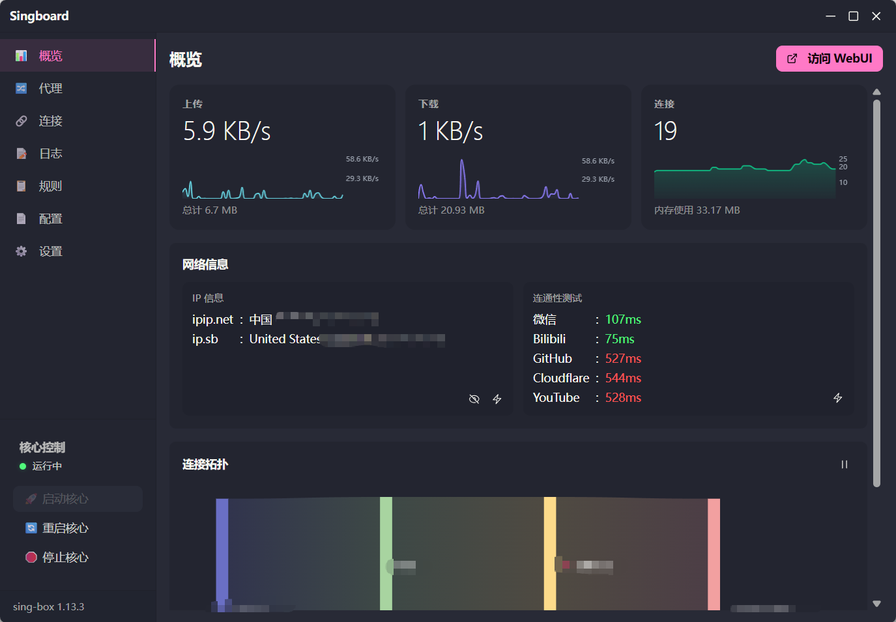
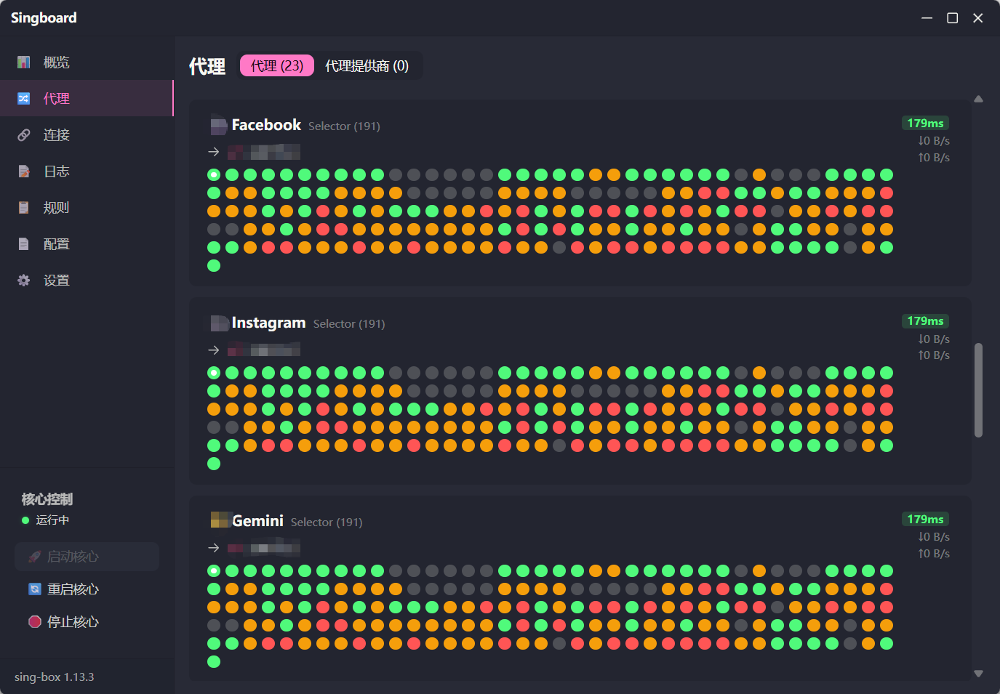
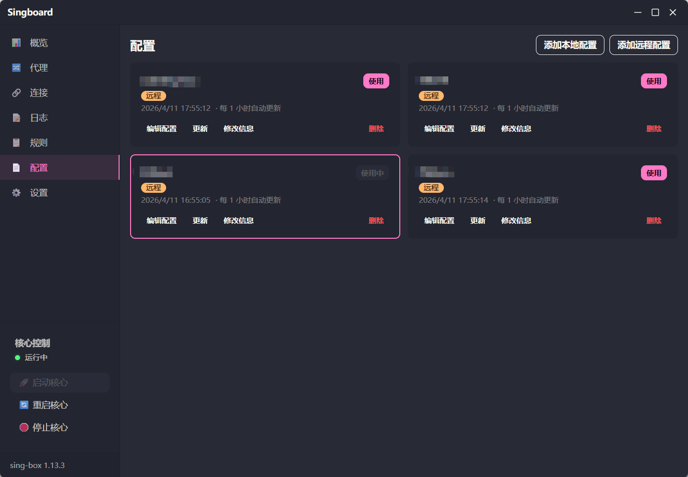
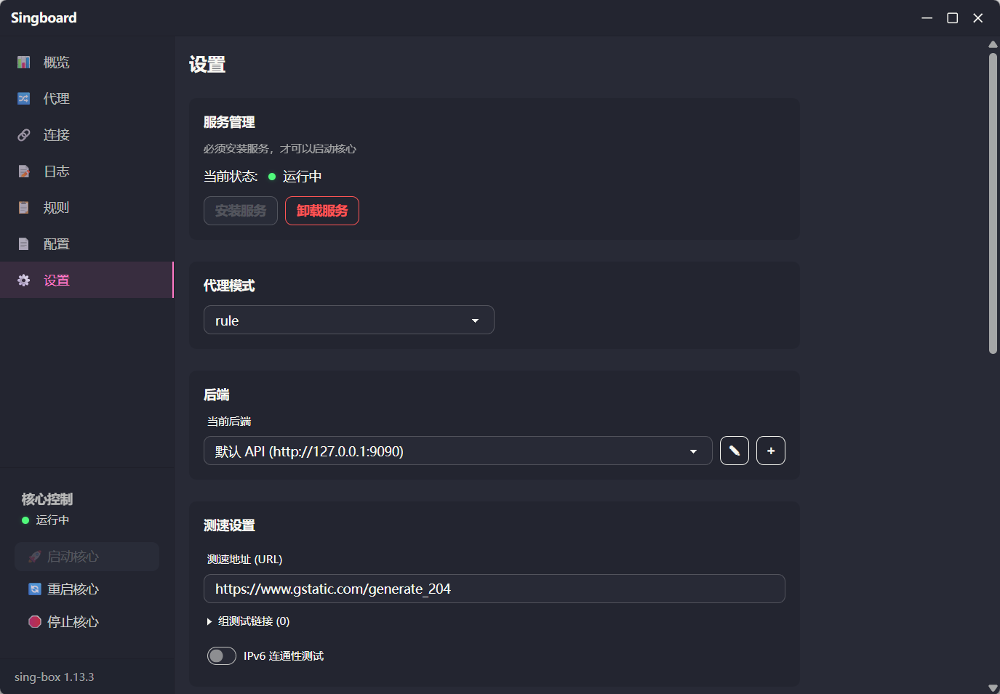

# Singboard for macOS 适配说明

感谢原作者开源的优秀项目，现适配给 MacOS。

<p>
  
  
  
  
</p>

## 使用前提

在运行本程序前，您需要手动下载 macOS 版 sing-box 内核并放置到工作目录：

1. 前往 [sing-box releases](https://github.com/SagerNet/sing-box/releases) 下载最新版 macOS 二进制文件

   - Apple Silicon（M 系列芯片）：选择 `sing-box-*-darwin-arm64.tar.gz`
   - Intel Mac：选择 `sing-box-*-darwin-amd64.tar.gz` 或 `sing-box-*-darwin-amd64-legacy-macos-10.13.tar.gz` （未测试，不确定是否能正常工作）

2. 解压后将二进制文件**改名为 `sing-box`**（去掉版本号后缀），放到您的工作目录（与 `config.json` 同级即可）

   > `.tar.gz` 包内的二进制文件可能已携带可执行权限，解压后无需再执行 `chmod +x`。

3. 由于 macOS Gatekeeper，首次运行可能需要在「系统设置 → 隐私与安全性」中手动点击「仍要允许」

## 权限说明

本项目使用 **SMJobBless 特权 Helper** 方案，sing-box 以 **root 身份**通过独立的系统级 Helper 进程运行，从而支持 TUN 入站、系统代理设置等需要高权限的功能。

- **首次启动核心**时，系统会弹出一次管理员密码授权对话框，用于将 Helper 安装到 `/Library/PrivilegedHelperTools/`
- 授权完成后，后续启动/停止/重启核心均**无需再次输入密码**
- Helper 以 LaunchDaemon 形式注册，开机后由 launchd 自动管理生命周期
- **关于 sing-box tun 入站**：由于 MacOS 在 dns 配置的优先级问题，单纯靠核心运行开启了 tun 入站的 sing-box 配置，无法劫持所有 dns 流量到 sing-box 核心处理，故针对带有 tun 入站的 sing-box 配置，会自动修改当前联网的网卡对应的 dns 服务器指向 tun，从而达成开启了 tun 入站的 sing-box 配置正常工作。并且停止核心时，会自动取消当前联网的网卡对应的 dns 服务器指向 tun 并恢复默认。该方案可能存在不稳定因素，可能会因为系统网络变化而失效导致 dns 异常，请知悉。但对于当前项目来说，这可能已经是目前最好的解决方案了。

## 与 Windows 版的差异说明

| 功能         | Windows 版                        | macOS 版                                                     |
| ------------ | --------------------------------- | ------------------------------------------------------------ |
| 服务管理     | Windows SCM（系统服务）           | SMJobBless 特权 Helper（LaunchDaemon）                       |
| 运行权限     | SYSTEM 账户                       | root（通过特权 Helper）                                      |
| Helper 位置  | 无                                | `/Library/PrivilegedHelperTools/singboard-helper`            |
| Daemon plist | 无                                | `/Library/LaunchDaemons/singboard.helper.plist`              |
| 参数存储     | 注册表 `HKLM\SYSTEM\...`          | `~/Library/Application Support/singboard/<name>/params.json` |
| IPC 通信     | 无                                | Unix Domain Socket `/var/run/singboard-helper.sock`          |
| 开机自启     | SCM `SERVICE_AUTO_START`          | LaunchDaemon `KeepAlive` 自动保活                            |
| 隐藏窗口     | `CREATE_NO_WINDOW` flag           | 直接无窗口（macOS 无此概念）                                 |
| 错误日志     | 工作目录/`singbox_last_error.log` | 同左；Helper 自身日志见 `/var/log/singboard-helper.log`      |
| 启动日志     | 工作目录/`startup.log`            | 同左                                                         |

> **逻辑完全一致**：配置处理逻辑（强制 trace 模式、临时配置文件生成）、启动日志泵、服务状态轮询、重启逻辑均与 Windows 版保持一致。

## 构建方法

```bash
# 安装前端依赖
pnpm install

# 开发模式
pnpm tauri dev

# 构建发行版（arm64）
pnpm tauri build --target aarch64-apple-darwin

# 构建发行版（x86_64）
pnpm tauri build --target x86_64-apple-darwin
```

> 需要事先安装 [Rust](https://rustup.rs/) 和 [Node.js](https://nodejs.org/)，以及 Tauri CLI：`cargo install tauri-cli`
>
> 构建时会同时编译 `singboard-helper` 二进制，并由 Tauri 自动打包进 `.app` bundle。

## 主要修改文件清单

```
src-tauri/
├── Cargo.toml                    # 移除 windows-service/windows-sys/winreg，新增 libc/ctrlc
├── build.rs                      # 移除 Windows manifest 注入
├── tauri.conf.json               # 移除 Windows bundle 配置，添加 macOS 最低版本
├── .cargo/config.toml            # 移除 Windows CRT 静态链接配置
└── src/
    ├── main.rs                   # 移除 #![cfg_attr(windows_subsystem)]
    ├── service/
    │   ├── scm.rs                # 完全重写：Windows SCM → SMJobBless IPC 客户端
    │   └── wrapper.rs            # 保留（供兼容引用，实际逻辑移至 helper）
    └── commands/
        ├── service.rs            # 新增 helper_status / helper_install / helper_uninstall 命令
        ├── binary.rs             # 移除 creation_flags(CREATE_NO_WINDOW)
        ├── config.rs             # 移除 creation_flags(CREATE_NO_WINDOW)
        └── network.rs            # User-Agent 更新为 macOS；新增系统代理读取与清除

helper/                           # 新增：特权 Helper 独立 crate
├── Cargo.toml
├── resources/
│   ├── Info.plist                # SMJobBless 所需的 Helper Info.plist
│   └── singboard.helper.plist    # LaunchDaemon plist
└── src/
    ├── main.rs                   # Helper 入口，验证 root 身份后启动 IPC 服务
    ├── protocol.rs               # IPC 消息协议定义（JSON over Unix socket）
    ├── ipc_server.rs             # Unix Domain Socket 服务端，分发命令
    └── process_mgr.rs            # 以 root 身份管理 sing-box 子进程
```
